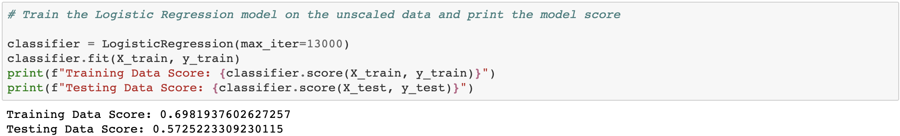
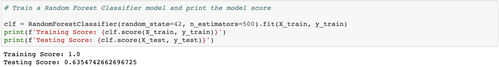
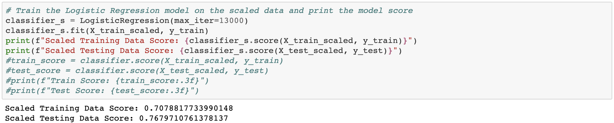
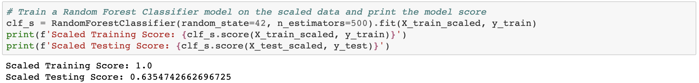

### Predicting-Credit-Risk
#### <i> Machine learning model that attempts to predict whether a loan from LendingClub will become high risk or not</i>

----------------------

**Description:**

LendingClub is a peer-to-peer lending services company that allows individual investors to partially fund personal loans as well as buy and sell notes backing the loans on a secondary market. LendingClub offers their previous data through an API.

Using this data to create machine learning models to classify the risk level of given loans. Specifically, comparing the Logistic Regression model and Random Forest Classifier.

<b>Datasets used:</b>

* [2019 Loans](Resources/2019loans.csv)

* [2021 Q1 Loans](Resources/2021Q1loans.csv)

### Tools used:
----------------------

  - Python
  - Pandas
  - Jupyter
  - SKLearn

### Analysis:
----------------------

#### Unscaled Models Prediction

I would expect Random Forest Classifier to perform better with the unscaled data. This is due to the way that the decision-making is done using Random Forest Classifier and making the best decision at each juncture.

#### Unscaled Models Comparison

As expected the Random Forest Classifier outperformed Logistic Regression for the unscaled Data.

#### Scaled Models Prediction

I expect Logistic Regression to outperform Random Forest Classifier with the scaled data. Logistic Regression tends to perform better when the data is scaled compared to Random Forest Classifier.

#### Scaled Models Comparison

As expected the Logistic Regression outperformed Random Forest Classifier with the scaled data.